<div align="center">

# 🚀 Momentum

### Your AI Agent's Remote Control

**Give your local AI agents a voice.** Approve sensitive actions, answer questions, and monitor progress from anywhere via Telegram.

[](https://github.com/HarshalPatel1972/momentum-zero/releases)
[](https://opensource.org/licenses/MIT)
[](https://golang.org/)
[](https://reactjs.org/)
[](https://modelcontextprotocol.io)

[Download Latest Release](https://github.com/HarshalPatel1972/momentum-zero/releases) • [Documentation](#-documentation) • [Discord Community](#-community--support)

<br />


</div>

---

## 📋 Table of Contents

- [The Problem](#-the-problem)
- [The Solution](#-the-solution)
- [Key Features](#-key-features)
- [Quick Start](#-quick-start)
- [Technical Architecture](#-technical-architecture)
- [Configuration](#-configuration)
- [Use Cases](#-real-world-use-cases)
- [Security & Privacy](#-security--privacy)
- [Troubleshooting](#-troubleshooting)
- [Development](#-development)
- [Community & Support](#-community--support)
- [License](#-license)

---

## 🎭 The Problem

You've built an autonomous AI agent to automate your workflow. You leave it running for 4 hours. When you return:

- ❌ It deleted the wrong files because it misunderstood instructions
- ❌ It got stuck on an ambiguous question and stopped entirely
- ❌ It sent 100 emails to the wrong recipients
- ❌ You have no idea what went wrong or when

**Local AI agents are powerful but dangerous when they run unsupervised.**

---

## ✨ The Solution

Momentum is the **human-in-the-loop bridge** for your local AI agents. It gives them a "voice" to:

| Capability | Description |
|------------|-------------|
| 🛡️ **Request Approval** | Before executing critical actions (file deletion, API calls, payments) |
| 💬 **Ask Questions** | When instructions are ambiguous or context is needed |
| 📊 **Report Progress** | Real-time notifications via Telegram |
| 🔄 **Continue Seamlessly** | Once you respond—no restarts needed |

Think of it as a **remote control for your AI agent's dangerous actions**.

### How It Works (3 Steps)

```mermaid
flowchart LR
    A[🔌 Install Momentum] --> B[🤖 Connect Your Agent]
    B --> C[📱 Control from Anywhere]
    
    style A fill:#0EA5E9,color:#fff
    style B fill:#8B5CF6,color:#fff
    style C fill:#10B981,color:#fff
```



1. **🔌 Install Momentum** → Run the setup wizard
2. **🤖 Connect Your Agent** → Add Momentum to your MCP-compatible AI (Claude, Cursor, etc.)
3. **📱 Control from Anywhere** → Approve/reject actions via Telegram

---

## 🎨 Key Features

### 🛡️ Secure Remote Approval System

Your agent sends a notification to your Telegram before executing sensitive operations:

```
🤖 Approval Required
━━━━━━━━━━━━━━━━━━━━━━━━━━━━━━━━
Your agent wants to:
DELETE FILE: /Documents/important.txt

Reason: Cleaning up old files
Risk Level: 🔴 HIGH
━━━━━━━━━━━━━━━━━━━━━━━━━━━━━━━━
[✅ Approve] [❌ Reject] [📝 Modify]
```

**Result:** You maintain full control without babysitting the terminal.

---

### 💬 Interactive Clarification

Agent encounters: *"Send the file to him"*

Instead of crashing or guessing, it asks:

```
❓ Clarification Needed
━━━━━━━━━━━━━━━━━━━━━━━━━━━━━━━━
Who is "him"?

A) John (Boss)
B) Mike (Client)  
C) Alex (Colleague)
━━━━━━━━━━━━━━━━━━━━━━━━━━━━━━━━
Reply with A, B, or C
```

**You respond** → Agent continues with confidence.

---

### 🔔 Real-Time Notifications

Get instant updates for:

| Event Type | Example |
|------------|---------|
| ✅ Task Completions | "Report generation finished" |
| ⚠️ Warnings | "File not found, skipping..." |
| 📈 Milestones | "50% complete (15/30 files)" |
| 🚨 Critical Failures | "API rate limit exceeded" |

---

### 🔌 Universal MCP Compatibility

Works with **any MCP-compliant AI client**:

<div align="center">

| Client | Status |
|--------|--------|
| Claude Desktop | ✅ Verified |
| Cursor IDE | ✅ Verified |
| Continue.dev | ✅ Verified |
| Cody | ✅ Verified |
| Custom MCP | ✅ Compatible |

</div>

**Integration is plug-and-play:**

```json
{
  "mcpServers": {
    "momentum": {
      "command": "C:\\momentum\\mcp-adapter.exe"
    }
  }
}
```

---

### 🔒 Privacy-First Architecture

| Principle | Implementation |
|-----------|----------------|
| **Local-first** | Your agent's data never touches our servers |
| **Secure tunneling** | Uses Ngrok with automatic HTTPS |
| **End-to-end** | Direct connection between your machine and Telegram |
| **No tracking** | Zero analytics, zero data collection |

---

## 🚀 Quick Start

### Prerequisites

- Windows 10/11 (64-bit)
- Active Telegram account
- MCP-compatible AI client (Claude Desktop, Cursor, etc.)

### Installation (5 Minutes)

#### 1️⃣ Download & Install

```bash
# Download latest release
https://github.com/HarshalPatel1972/momentum-zero/releases/latest

# Run installer
momentum-setup.exe
```

#### 2️⃣ Create Telegram Bot

1. Open Telegram and message [@BotFather](https://t.me/BotFather)
2. Send: `/newbot`
3. Choose a name: "My Momentum Bot"
4. Copy the API token (looks like: `123456789:ABCdefGHIjklMNOpqrsTUVwxyz`)

#### 3️⃣ Configure Momentum

1. Launch Momentum
2. Paste your Telegram bot token
3. Click **"Start Bridge"**
4. Save the MCP config path shown

#### 4️⃣ Connect Your AI Agent

<details>
<summary><b>📘 Claude Desktop</b></summary>

Edit `%APPDATA%/Claude/claude_desktop_config.json`:

```json
{
  "mcpServers": {
    "momentum": {
      "command": "C:\\Program Files\\Momentum\\mcp-adapter.exe"
    }
  }
}
```

</details>

<details>
<summary><b>📘 Cursor IDE</b></summary>

1. Open Settings → Extensions → MCP
2. Add server: `momentum`
3. Command: `C:\Program Files\Momentum\mcp-adapter.exe`

</details>

<details>
<summary><b>📘 Continue.dev</b></summary>

Edit your Continue configuration:

```json
{
  "mcpServers": {
    "momentum": {
      "command": "C:\\Program Files\\Momentum\\mcp-adapter.exe"
    }
  }
}
```

</details>

#### 5️⃣ Test It

Ask your AI agent:

> "Use Momentum to ask me for approval before deleting any files"

✅ You'll receive a Telegram notification!

---

## 🏗️ Technical Architecture

```
┌─────────────────────────────────────────────────────────────┐
│                      Your Machine                            │
│  ┌─────────────────┐                                        │
│  │    AI Agent     │  ← Claude Desktop, Cursor, etc.        │
│  │    (Local)      │                                        │
│  └────────┬────────┘                                        │
│           │ MCP Protocol                                    │
│           ▼                                                 │
│  ┌─────────────────┐                                        │
│  │    Momentum     │  ← This app (Go + React)               │
│  │     Bridge      │                                        │
│  └────────┬────────┘                                        │
│           │ HTTPS (Ngrok)                                   │
└───────────┼─────────────────────────────────────────────────┘
            │
            ▼
    ┌───────────────┐
    │   Internet    │
    └───────┬───────┘
            │
            ▼
    ┌───────────────┐
    │ Telegram Bot  │  ← Your notifications
    │   Platform    │
    └───────────────┘
```

### Technology Stack

| Layer | Technology |
|-------|------------|
| **Backend** | Go 1.21+ (HTTP server, MCP implementation) |
| **Frontend** | React 18 + TypeScript (Dashboard UI) |
| **Framework** | Wails v2 (Native desktop app) |
| **Tunneling** | Ngrok (Secure HTTPS endpoints) |
| **Protocol** | Model Context Protocol (MCP) |
| **Messaging** | Telegram Bot API |

---

## ⚙️ Configuration

### Environment Variables

```bash
# .env file (auto-generated)
TELEGRAM_BOT_TOKEN=your_bot_token
NGROK_AUTH_TOKEN=auto_generated
MCP_PORT=8080
LOG_LEVEL=info
```

### Advanced Settings

```json
// config.json
{
  "approval_timeout": 300,        // 5 minutes to respond
  "notification_sound": true,
  "risk_levels": {
    "file_deletion": "HIGH",
    "api_calls": "MEDIUM",
    "read_operations": "LOW"
  },
  "auto_approve": {
    "enabled": false,             // Safety first!
    "whitelist": []
  }
}
```

---

## 💼 Real-World Use Cases

<details>
<summary><b>🧑‍💻 For Developers — Long-running refactoring scripts</b></summary>

**Without Momentum:**
```bash
# Agent runs for 2 hours...
rm -rf src/legacy    # Oops, deleted wrong folder!
```

**With Momentum:**
```
🤖 Approval Request
━━━━━━━━━━━━━━━━━━━━━━━━
Delete folder: /src/legacy
Contains: 47 files (12.3 MB)
━━━━━━━━━━━━━━━━━━━━━━━━
[✅ Approve] [❌ Reject] [👁️ View Files]
```

</details>

<details>
<summary><b>📝 For Content Creators — Automated blog post generation</b></summary>

**Without Momentum:**
- Agent publishes 10 posts with wrong tone
- You discover it 6 hours later

**With Momentum:**
```
🤖 Review Needed
━━━━━━━━━━━━━━━━━━━━━━━━
Draft title: "10 Ways AI Will Destroy Humanity"
Tone detected: Alarmist (⚠️ May hurt brand)
━━━━━━━━━━━━━━━━━━━━━━━━
[✅ Publish] [✏️ Revise] [❌ Discard]
```

</details>

<details>
<summary><b>📊 For Data Analysts — Automated data scraping</b></summary>

**Without Momentum:**
```python
# Agent encounters unknown format
# Script crashes after 3 hours
```

**With Momentum:**
```
🤖 Clarification Needed
━━━━━━━━━━━━━━━━━━━━━━━━
Found new data format: CSV with semicolons
Use semicolon as delimiter?
━━━━━━━━━━━━━━━━━━━━━━━━
[Yes] [No] [Show Sample]
```

</details>

---

## 🔐 Security & Privacy

### What We Collect

**Nothing.** Momentum is 100% local-first:

- ✅ No telemetry
- ✅ No crash reports sent to servers
- ✅ No usage analytics
- ✅ No account creation required

### How Data Flows


**At no point does Momentum store or log your agent's actions.**

### Threat Model

| Attack Vector | Mitigation |
|---------------|------------|
| MitM on Ngrok tunnel | ✅ HTTPS with auto-generated certs |
| Unauthorized Telegram access | ✅ Bot token is private, one-time setup |
| Local file tampering | ✅ Config files use restricted permissions |
| Malicious MCP commands | ✅ Approval system blocks all risky actions |

### Audit Trail

Momentum maintains a **local-only** log:

```
logs/
├── approvals.log      # Your decisions (never uploaded)
├── agent-actions.log  # What your agent requested
└── errors.log         # Debug information
```

**Retention:** 30 days, then auto-deleted.

---

## 🩺 Troubleshooting

<details>
<summary><b>"Bridge Failed to Start"</b></summary>

```powershell
# Check if port 8080 is in use
netstat -ano | findstr :8080

# Kill the process if needed
taskkill /PID <process_id> /F

# Restart Momentum
```

</details>

<details>
<summary><b>"Telegram Bot Not Responding"</b></summary>

1. Verify bot token is correct (`@BotFather → /mybots`)
2. Ensure bot is not in privacy mode (`@BotFather → /mybots → Settings → Privacy → Disable`)
3. Send `/start` to your bot in Telegram

</details>

<details>
<summary><b>"MCP Connection Timeout"</b></summary>

```json
// Increase timeout in claude_desktop_config.json
{
  "mcpServers": {
    "momentum": {
      "command": "C:\\Program Files\\Momentum\\mcp-adapter.exe",
      "timeout": 30000  // 30 seconds
    }
  }
}
```

</details>

### Debug Mode

```bash
# Enable verbose logging
momentum.exe --debug

# Logs saved to: C:\Users\<you>\AppData\Local\Momentum\logs
```

### Still Stuck?

- 📖 [Full Documentation](https://docs.momentum.dev)
- 💬 [Discord Support](https://discord.gg/momentum)
- 🐛 [Report Bug](https://github.com/HarshalPatel1972/momentum-zero/issues)

---

## 🛠️ Development

### Build from Source

#### Prerequisites

```bash
# Install Go 1.21+
https://golang.org/dl/

# Install Wails CLI
go install github.com/wailsapp/wails/v2/cmd/wails@latest

# Install Node.js 18+
https://nodejs.org/
```

#### Clone & Build

```bash
# Clone repository
git clone https://github.com/HarshalPatel1972/momentum-zero.git
cd momentum-zero

# Development mode with hot reload
wails dev

# Build production binary
wails build  # Output: build/bin/momentum.exe
```

### Project Structure

```
momentum-zero/
├── backend/
│   ├── bridge/         # MCP server implementation
│   ├── telegram/       # Telegram bot handler
│   ├── ngrok/          # Tunnel manager
│   └── config/         # Configuration logic
├── frontend/
│   ├── src/
│   │   ├── components/ # React UI components
│   │   ├── hooks/      # Custom React hooks
│   │   └── App.tsx     # Main dashboard
│   └── wailsjs/        # Auto-generated Wails bindings
├── docs/               # Documentation & screenshots
├── build/              # Build output
└── main.go             # Entry point
```

### Running Tests

```bash
# Backend tests
go test ./backend/...

# Frontend tests
cd frontend && npm test

# Integration tests
go test -tags=integration ./tests/...
```

### Contributing

See [CONTRIBUTING.md](./CONTRIBUTING.md) for guidelines.

**Quick Contribution Steps:**
1. Fork the repo
2. Create feature branch (`git checkout -b feature/amazing-feature`)
3. Commit changes (`git commit -m 'feat: add amazing feature'`)
4. Push to branch (`git push origin feature/amazing-feature`)
5. Open Pull Request

### Roadmap

- [ ] WhatsApp integration
- [ ] Slack integration
- [ ] Multi-agent orchestration
- [ ] Mobile app (React Native)
- [ ] Custom approval workflows
- [ ] Action history analytics

---

## 🌟 Community & Support

### Get Involved

| Platform | Link |
|----------|------|
| 💬 Discord | [Join Server](https://discord.gg/momentum) |
| 🐦 Twitter/X | [@momentum_ai](https://x.com/momentum_ai) |
| 📺 YouTube | [Tutorials & Demos](https://youtube.com/@momentum) |
| 📧 Newsletter | [Monthly Updates](https://momentum.dev/newsletter) |

### Contributors

<a href="https://github.com/HarshalPatel1972/momentum-zero/graphs/contributors">
  
</a>

### Star History

[](https://star-history.com/#HarshalPatel1972/momentum-zero&Date)

---

## 📄 License

This project is licensed under the MIT License - see the [LICENSE](LICENSE) file for details.

---

## 🙏 Support the Project

If Momentum saves you time and headaches, consider:

| Action | Impact |
|--------|--------|
| ⭐ **Star this repo** | Show your support |
| 🐛 **Report bugs** | Help us improve |
| 💡 **Share ideas** | Shape the roadmap |
| 📢 **Spread the word** | Help others discover it |
| ☕ [**Buy me a coffee**](https://buymeacoffee.com/harshalpatel) | Fuel development |

---

<div align="center">

### Acknowledgments

Built with these amazing technologies:

[Model Context Protocol](https://modelcontextprotocol.io) • [Wails](https://wails.io) • [Ngrok](https://ngrok.com) • [Telegram Bot API](https://core.telegram.org/bots/api)

---

**Made with ❤️ by [Harshal Patel](https://github.com/HarshalPatel1972)**

[Website](https://momentum.dev) • [Docs](https://docs.momentum.dev) • [Twitter](https://x.com/momentum_ai)

*Momentum: Because your AI agents shouldn't work alone.*

</div>
